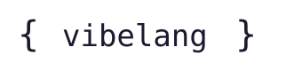

<p align="center">
  <picture>
    <source media="(prefers-color-scheme: dark)" srcset="landing-page/assets/logo.svg">
    <source media="(prefers-color-scheme: light)" srcset="landing-page/assets/logo_dark.svg">
    
  </picture>
</p>

<h3 align="center">Make music with code.</h3>

<p align="center">
  <a href="https://crates.io/crates/vibelang-cli"></a>
  <a href="https://docs.rs/vibelang-core"></a>
  <a href="https://crates.io/crates/vibelang-cli"></a>
  <a href="https://github.com/trusch/vibelang/stargazers"></a>
</p>

<p align="center">
  <a href="https://vibelang.org">Website</a> •
  <a href="https://vibelang.org/#/docs">Documentation</a> •
  <a href="https://vibelang.org/#demo">Examples</a> •
  <a href="https://github.com/trusch/vibelang/issues">Issues</a>
</p>

---

VibeLang is a programming language for making music. Write beats, melodies, and full tracks in code — then edit, save, and **hear it change instantly**.

```ts
set_tempo(120);

import "stdlib/drums/kicks/kick_808.vibe";
import "stdlib/bass/sub/sub_deep.vibe";

let kick = voice("kick").synth("kick_808").gain(db(-6));
let bass = voice("bass").synth("sub_deep").gain(db(-12));

pattern("groove").on(kick).step("x... x... x..x ....").start();
melody("line").on(bass).notes("C3 - - - | C3 - G2 -").start();
```

That's a whole beat. Just run it and edit while it plays.

<br>

## ✨ Features

| | |
|---|---|
| **880+ Built-in Sounds** | Drums, bass, leads, pads, keys, world instruments, effects — all as editable `.vibe` files |
| **~1ms Hot Reload** | Edit your code, save, hear it change. No restart needed. Errors don't kill the audio. |
| **Git-Friendly** | Your music is plain text. Diff it, branch it, collaborate on it. |
| **SuperCollider Powered** | Professional-grade audio engine under the hood |
| **HTTP API** | REST + WebSocket control on port 1606 — drive playback and parameters from external tools |
| **Zero Config** | `cargo install vibelang-cli` and you're ready to make music |

<br>

## 🚀 Quick Start

### Prerequisites

- [SuperCollider](https://supercollider.github.io/) — the audio engine
- [JACK Audio](https://jackaudio.org/) (Linux/Mac) or your system audio

### Install

```bash
cargo install vibelang-cli
```

### Your First Beat

Create `hello.vibe`:

```ts
set_tempo(110);

import "stdlib/drums/kicks/kick_808.vibe";

let kick = voice("kick").synth("kick_808").gain(db(-6));

pattern("four_on_floor")
    .on(kick)
    .step("x...x...x...x...")
    .start();
```

Run it:

```bash
vibe hello.vibe
```

Edit the pattern. Save. Hear it change. **That's the vibe.**

### Live Hardware Profiles

Use `--profile` when a rig must not fall back to the CLI's default two inputs
and two outputs:

```bash
vibe run --profile rig.toml set.vibe
```

A script can make that profile mandatory for every invocation by declaring it
within its first 32 lines. Relative paths resolve beside the script:

```rhai
// vibe-profile: rig.toml
```

Profiles declare channel counts, logical input/output names, PipeWire port
patterns, required or optional user services, PipeWire or MIDI endpoints, and
whether an optional loss may start in `DEGRADED`. Invalid or conflicting
configuration is `FAILED`; a missing required dependency/link is `WAITING`.
Both states exit before script evaluation or Transport Start. `READY`, or
explicitly permitted `DEGRADED`, prints the verified logical I/O map once before
the script runs.

<br>

## 📖 Language Overview

### Patterns — Step Sequencing

```ts
// x = hit, . = rest, 0-9 = velocity levels
pattern("drums")
    .on(kick_voice)
    .step("x...x...x..x....")
    .start();

// Euclidean rhythms
pattern("afro").on(perc).euclid(5, 8).start();
```

### Melodies — Note Sequences

```ts
melody("bassline")
    .on(bass_voice)
    .notes("C2 - - . | E2 - G2 . | A2 - - - | G2 . E2 .")
    .start();

// C4, A#3, Bb2 = pitches  |  - = hold  |  . = rest
```

### Voices & Synths

```ts
let lead = voice("lead")
    .synth("lead_bright")
    .gain(db(-6))
    .poly(4)
    .set_param("cutoff", 2000.0);
```

### Groups & Effects

```ts
let drums = define_group("Drums", || {
    let kick = voice("kick").synth("kick_808");
    let snare = voice("snare").synth("snare_808");

    pattern("kick").on(kick).step("x...x...").start();
    pattern("snare").on(snare).step("....x...").start();

    fx("verb").synth("reverb").param("room", 0.3).apply();
});
```

### Custom Sound Design

```ts
define_synthdef("my_bass")
    .param("freq", 110.0)
    .param("amp", 0.5)
    .param("gate", 1.0)
    .body(|freq, amp, gate| {
        let osc = saw_ar(freq) + saw_ar(freq * 1.01);
        let filt = rlpf_ar(osc, 800.0, 0.3);
        let env = envelope()
            .adsr(0.01, 0.1, 0.5, 0.2)
            .gate(gate)
            .cleanup_on_finish()
            .build();
        filt * env * amp
    });
```

### Named-Input Processors

Custom synthdefs can declare patchable audio inputs with
`.input("name")` for mono or `.input("name", channels)` for mono/stereo
processors. Patch them from scripts with
`target.input("name").from(source)`, where `source` can be a voice,
group, current group, or silence.

```ts
define_synthdef("lowpass_box")
    .input("in", 2)
    .param("cutoff", 1200.0)
    .body_map(|p| rlpf_ar(p.inputs.in, p.cutoff, 0.4));

let target = voice("filter").synth("lowpass_box");
target.input("in").from(source);
```

The standard library ships the first named-input processor catalogue under
`stdlib/processors/`, following `design-named-input-stdlib-primitive-catalogue`:
passthrough, lowpass, ring modulation, stereo crossfade, and stereo mixer
primitives. See the [custom synthesis reference](docs/reference/dsp.md)
and [runtime-object reference](docs/reference/runtime-objects.md) for the full
authoring and routing contract.

<br>

## 🎹 Standard Library

VibeLang comes with **880+ ready-to-use instruments and effects**:

| Category | Examples |
|----------|----------|
| **Drums** (125) | kick_808, snare_909, hihat_closed, clap, toms, percussion |
| **Bass** (75) | sub_deep, acid_303, reese, moog, upright |
| **Leads** (50) | supersaw, pluck, brass, strings |
| **Pads** (41) | warm, shimmer, analog, cinematic |
| **Keys** (19) | grand_piano, rhodes, wurlitzer, hammond |
| **World** (24) | sitar, tabla, kalimba, koto, erhu |
| **Effects** (66) | reverb, delay, chorus, distortion, compressor |

All sounds are plain `.vibe` files — read them, tweak them, learn from them.

<br>

## 📚 Learn More

- **[Tutorial Course](examples/tutorials/README.md)** — 20 hands-on lessons included in this repo
- **[vibelang.org](https://vibelang.org)** — Full documentation, tutorials, and examples
- **[VibeLang API Reference](docs/README.md)** — `.vibe`, tools, protocols, and generated indexes
- **[Rust API Reference](https://docs.rs/vibelang-core)** — embedding and crate documentation
- **[Examples](https://github.com/trusch/vibelang/tree/main/examples)** — Sample projects and tracks

<br>

## 🛠️ Development Status

VibeLang is in **alpha**. Core features work well, but expect changes.

**Working great:** Patterns, melodies, sequences, hot reload, synthdefs, groups, effects

**Experimental:** SFZ instruments (melodies don't auto-send NOTE_OFF yet, so sustained regions can hang — use `.note_off(note)` as a workaround), VST plugins, MIDI input, complex automation

Found a bug? Have an idea? [Open an issue](https://github.com/trusch/vibelang/issues).

<br>

## 💡 Why VibeLang?

- **Text is powerful.** Copy, paste, diff, git, grep. Your music is code.
- **Instant feedback.** Edit-save-hear in milliseconds.
- **Transparent.** Every sound is a readable file. No black boxes.
- **Deep when you need it.** From 4-line beats to full productions.

<br>

## 📄 License

MIT

---

<p align="center">
  <i>Made with 🎵 and loud bass.</i>
</p>
